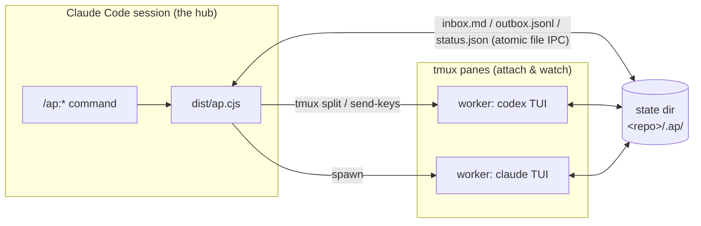
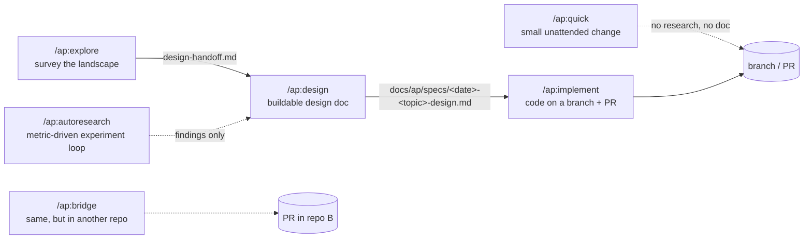

# agglomeration-platform

[](https://github.com/WingsOfPanda/agglomeration-platform/actions/workflows/ci.yml)
[](LICENSE)

**Multi-model tmux orchestration for Claude Code.** A **hub** — a Claude Code session running
`/ap:*` slash commands — spawns and steers real interactive model TUIs (`codex` / `claude` /
`agy` / `opencode`) as **tmux panes you can attach to and watch**. Coordination is file-based IPC
(inbox / outbox / status / pane), so the external model binaries behave exactly as they do on
their own — agglomeration-platform just orchestrates them.

The platform agglomerates agents: the orchestrating session is the **hub**, each model TUI is an
**agent**, a spawned agent working a task is a **worker**, and agents are grouped into color-coded
**clusters** (azure / sage / amber / slate / ivory / violet) so concurrent panes stay visually
distinguishable. The commands are plain verbs — `quick`, `explore`, `design`, `implement`,
`autoresearch`, `review`.

> agglomeration-platform is a TypeScript rewrite of an earlier Bash plugin. The packaging changed
> (one committed `dist/ap.cjs`, zero-build install); the wire protocol, state layout, and tmux
> mechanics are byte-compatible so the model binaries are drop-in. Historical specs and plans under
> `docs/` predate a project rename and are kept as a dated record — the shipped code is the source
> of truth.

---

## The picture



What your terminal actually looks like mid-run — the hub keeps its pane, every worker is a real
pane with a color-coded border label:

```
┌──────────────────────────────┬──────────────────────────────┐
│ hub — Claude Code            │ [azure] mike-codex · topic    │
│ > /ap:design "..."           │  codex TUI, working…          │
│   design research-wait …     ├──────────────────────────────┤
│                              │ [sage] victor-claude · topic  │
│                              │  claude TUI, working…         │
└──────────────────────────────┴──────────────────────────────┘
```

And the intended flow between commands:



`check` / `list` / `review` / `stop` are the operational glue around all of it.

---

## Install

agglomeration-platform ships as a Claude Code plugin via its own marketplace:

```
/plugin marketplace add WingsOfPanda/agglomeration-platform
/plugin install ap@agglomeration-platform
```

To update later: `/plugin marketplace update`, then re-install/upgrade. There is no build step —
`dist/ap.cjs` is committed.

### Requirements

- **Claude Code** — the hub runs as a Claude Code session.
- **tmux ≥ 3.0**, and the hub session must run **inside tmux** — every worker is a real pane.
- **At least one model CLI on `PATH`** — `codex`, `claude`, `agy`, or `opencode`. Run `/ap:check`
  to detect what is available and pick your active set.

> **Security posture, stated plainly:** in the default `full` mode, workers are launched with
> their CLI's permission-bypassing flag (e.g. `codex --dangerously-bypass-approvals-and-sandbox`,
> `claude --permission-mode auto`). Sandboxing is honor-system; workers can run shell commands and
> reach the network. Point the platform only at repositories and tasks you would trust an
> unattended agent with. `/ap:autoresearch` states this loudest in its own directive.

### Five-minute start

1. Install (above), open a Claude Code session **inside tmux** in the repo you want to work on.
2. `/ap:check` — verifies tmux/state/config, detects model CLIs, lets you pick the provider set.
3. `/ap:quick "rename FooService to BarService and fix all call sites"` — one worker implements
   it unattended on its own branch; the hub briefs, verifies, and (by default) pushes + opens a PR.
4. Watch it live: the worker is a tmux pane — click into it or `tmux select-pane`.
5. `/ap:list` shows active workers; `/ap:stop <topic>` tears down and archives.

When the task needs research before code, use the pipeline instead:
`/ap:explore` → `/ap:design` → `/ap:implement` (worked example below).

---

## Which command do I want?

| You want… | Reach for |
|---|---|
| A small, clearly-specified change made unattended | [`/ap:quick`](#apquick) |
| To survey SOTA / think from multiple angles, **without** committing to a plan | [`/ap:explore`](#apexplore) |
| A buildable, audited design doc ("design X", "should we adopt X?") | [`/ap:design`](#apdesign) |
| To turn a design doc into code, cross-verified, on a branch | [`/ap:implement`](#apimplement) |
| A metric-driven experiment loop that never touches real code | [`/ap:autoresearch`](#apautoresearch) |
| The same orchestration, but the work belongs in a *different* repo | [`/ap:bridge`](#apbridge) |
| Health check + pick which model CLIs to use | [`/ap:check`](#apcheck) |
| See / end running workers | [`/ap:list`](#aplist) · [`/ap:stop`](#apstop) |
| Review the problems your past runs recorded | [`/ap:review`](#apreview) |

---

## Commands

### `/ap:quick`

```
/ap:quick "<task text>" [--provider codex|claude|agy|opencode] [--no-finish] [--stash-wip]
```

The light pipeline: **one worker implements a clear single-repo change unattended** on its own
`feat/quick-<topic>` branch — no research, no design doc, no interactive gates. The hub writes the
brief, waits, verifies, and finishes.

- **Finishing is the default**: with a git remote, the branch is pushed and a PR opened; without
  one, the branch is kept and your starting branch restored. `--no-finish` keeps it local.
- `--stash-wip` parks any pre-existing uncommitted WIP in an identity-checked git stash before the
  branch forks, so the PR carries only the worker's commits, and restores it at finish.
- You get: the branch/PR, a `SUMMARY.md`, archived worker state, and forensics for `/ap:review`.

When the task is fuzzy, contested, or architectural — don't `quick` it; run the pipeline.

### `/ap:explore`

```
/ap:explore <topic — what to survey / think deeply about>
```

Deep multi-aspect exploration: N workers research the topic in parallel (with a literature-weight
classifier steering how academic each worker goes), then the hub synthesizes a landscape draft,
runs a confidence gate, and — unless the gate passes — sends **every worker back as an adversary
against the synthesis**, with rebuttal, gap-enrichment, and sign-off rounds. The hub itself never
retrieves; workers are the only searchers.

- You get (in the archived run dir): `landscape-<date>-<topic>.md` (approaches, tradeoff matrix,
  contested claims, citations), `design-handoff.md` (the seed for `/ap:design`), and a
  per-worker contribution scoreboard. The Conclusion is printed to chat.
- The suggested next step is printed verbatim: `/ap:design <archive>/design-handoff.md`.

Explore answers *"what's out there and what should we think?"* — it deliberately does **not**
produce a buildable plan. That's design's job.

### `/ap:design`

```
/ap:design [--ensemble] <topic — what to research / design>
```

Cross-verified multi-model investigation that ends in **one deploy-schema design doc** (Problem /
Goal / Architecture / Components / Testing / Success Criteria) which must pass a mechanical
deploy-audit gate. Routing is automatic: simple topics take a hub fast-path; conflicting evidence,
high stakes, or `--ensemble` escalate to a 2–3 worker ensemble that researches independently,
N-way-diffs its findings, cross-verifies each other's solo claims, and adjudicates — then the hub
walks the six sections with you interactively.

- You get: `docs/ap/specs/<date>-<topic>-design.md` — exported into your repo as the primary,
  discoverable copy — plus the full research trail in the archived run dir.
- Feed it an explore handoff for grounded research, or a raw topic for a fresh investigation.

### `/ap:implement`

```
/ap:implement [<design-doc-path>] [--no-branch] [--topic <slug>] [--max-rounds N]
```

Turns a deploy-schema design doc into code, single-repo. The doc is **audited first** (schema
gate); one worker plans, implements, and self-verifies on `feat/implement-<TOPIC>` while the hub
**cross-verifies with its own independent test re-run** — the worker's green log is a claim, not
evidence — and drives a bounded fix-loop (default 5 rounds). Worker objections and questions are
relayed to you with verified claims attached.

- With no doc path, the newest exported design doc is offered.
- Ends with a finish menu — **merge / push+PR / keep / discard** — then scope-conformance check,
  forensics, teardown, archive.
- The worker pane stays attached the whole run; `tmux select-pane` to watch it code.

### `/ap:autoresearch`

```
/ap:autoresearch <objective> [--metric k=v,...] [--time-budget none|<N>h] [--seed-from <path>] [--autonomous]
```

The heavyweight loop: lock a **measurable metric**, sweep SOTA once, spawn 2–3 persistent `codex`
workers, and adaptively dispatch single-config experiments until a stop condition — target met,
plateau, or budget. **Explore-only: it never touches your real repo.** Promotion to real code is
`/ap:implement`.

What makes it trustworthy is the **research-validity layer** — a worker's self-reported metric is
treated as a claim, not evidence:

- the hub **re-runs each result's scoring step** outside the worker's pane and adjudicates;
- mechanical **sanity/integrity gates** (ceiling, under-run, log-contradiction, config drift);
- **INFEASIBLE vs REFUTED** — a botched run never masquerades as a refuted idea or a false leader;
- an approach-aware **coverage/diversity guard** against converging on one family;
- typed Draft/Improve **operators with lineage**, so a metric delta is attributable;
- an **independent re-implementation inspector** that regenerates a new-best experiment from its
  run-card alone and re-derives the metric — a confident non-reproduction demotes the leader.

You get: per-experiment `result.json`s, a scoreboard, `session-summary.md`, a handoff for design,
and cross-run lessons accumulated under the global state root. `--autonomous` machine-seeds the
metric/budget prompts so the loop never stops to ask.

### `/ap:bridge`

```
/ap:bridge --repo <abs-path-to-other-repo> "<opening task>" [--provider …] [--in-place]
```

Cross-repo work without leaving your session: the hub stays in repo A while **one persistent
worker co-develops in repo B** over open-ended rounds — you review diffs, send refinements, and
the worker's real questions are relayed to you. Finishes as a PR in repo B (default branch mode);
`--in-place` commits directly on repo B's current branch instead.

### `/ap:check`

```
/ap:check
```

Health check — tmux version, pane-border config, state dirs, shipped config, provider CLIs — plus
an interactive picker that selects the **active provider set** used by ensemble commands. The
choice persists per machine.

### `/ap:list`

```
/ap:list [<topic>]
```

Show active workers (pane ids + live state from their status files), optionally scoped to one
topic. Read-only; flags a `working` worker as `stale` after prolonged outbox silence.

### `/ap:stop`

```
/ap:stop <topic>  |  /ap:stop <agent> <topic>  |  /ap:stop --all --yes
```

Gracefully end workers — each pane gets a `DONE` banner — and archive their state under the
global archive root.

### `/ap:review`

```
/ap:review
```

Every command records **forensics** at teardown (spawn failures, worker errors and questions,
`FLAG:` notes, audit issues — plus the hub's own reflection). `review` surveys everything recorded
since you last looked, clusters recurring patterns with their lifetime trend, suggests one concrete
action per cluster, then files the reviewed records away so the next run starts clean. Run it
periodically; it is how the platform's own bugs get found.

---

## Worked example: explore → design → implement

Say you're maintaining a service and suspect its cache layer needs a smarter eviction policy, but
you genuinely don't know the landscape.

```text
/ap:explore survey adaptive cache-eviction policies (ARC, LIRS, TinyLFU, ML-driven) for a
read-heavy KV service; what do modern systems actually ship, and what fits a 10GB in-process cache?
```

Two or three workers research in parallel — panes you can watch — then attack each other's claims.
You end with `landscape-….md` (a tradeoff matrix with citations, contested claims marked) and
`design-handoff.md`. The run prints its own next step:

```text
/ap:design ~/.ap/archive/<hash>/<topic>/_explore-<ts>/design-handoff.md
```

Design routes by complexity — this one escalates to an ensemble, the workers' findings get
N-way-diffed and cross-verified, and you approve each section interactively. It exports:

```text
docs/ap/specs/2026-08-09-adaptive-cache-eviction-design.md
```

Then:

```text
/ap:implement docs/ap/specs/2026-08-09-adaptive-cache-eviction-design.md
```

The doc is audited, one worker implements it on `feat/implement-adaptive-cache-…` (objecting
before writing code if the design is wrong — objections come to you), the hub re-runs the tests
itself, drives fix rounds if needed, and finishes with merge/PR/keep/discard. Total ceremony you
performed: three commands and a few approvals.

---

## Operating & tuning

All knobs are environment variables read by the bundled CLI — export them in the hub's shell, or
prefix a single command. They survive plugin updates (unlike editing the shipped config).

### The knobs you'll actually touch

| Var | What it does | Default | Notes |
|---|---|---|---|
| `AP_HOME` | Collapse **both** state roots (live state *and* archive/forensics) into one dir | two roots, see below | the test-isolation knob |
| `AP_CONSULT_TIMEOUT_<KIND>` | Per-phase worker wait budget (seconds), before the provider multiplier | research 600 · verify 300 · adversary 600 · experiment 1800 · openq 300 · rebuttal 300 · gap 600 · signoff 300 | kinds: `RESEARCH VERIFY ADVERSARY EXPERIMENT OPENQ REBUTTAL GAP SIGNOFF`. Explore's cross-verify reuses **`VERIFY`** — there is no `…_CROSSVERIFY`. Invalid values fall through, never NaN. |
| `AP_WAIT_EXTEND_MULT` | Extend an expired wait up to N× while the worker's pane is still alive | `3` (cap 10) | **`1` is the only off-switch** — `0`/unset fall back to 3 |
| `AP_ARTIFACT_GRACE_S` | How long a wait holds after a worker's `done` for its artifact to finish (sentinel or quiescence) | `60` (clamp 10–300) | **`0` disables the artifact-completeness layer entirely** |
| `AP_TURN_CONFIRM_S` | Quiet window a turn/round wait needs after a terminal event before it classifies the turn (quick · implement · bridge) | `20` (clamp 5–120) | **`0` disables the terminal-confirmation layer entirely**; a worker still writing vetoes the classification (at most 2 vetoes) |
| `AP_QUICK_TURN_TIMEOUT` | quick's turn wall-clock | `14400` (4 h) | |
| `AP_IMPLEMENT_TURN_TIMEOUT_S` | implement's turn wall-clock | `14400` | |
| `AP_DUET_TURN_TIMEOUT` | bridge's round wall-clock (legacy name, still the one the code reads) | `14400` | |
| `AP_ULTRACODE` | `=0` strips the `ultracode` keyword from **claude** workers' nudges | on for claude | per-dispatch prefix works: `AP_ULTRACODE=0 …` |

### The rest

| Var | What it does | Default |
|---|---|---|
| `AP_IMPLEMENT_TEST_TIMEOUT_S` | cap on the hub's independent test re-run | `1800` |
| `AP_IMPLEMENT_VERIFY_MAX_S` | worker-reported suite duration above which the hub skips its re-run (`VERDICT=skipped`) | = test timeout |
| `AP_DRILLDOWN_TIMEOUT_S` | design's drilldown turn budget | `600` |
| `AP_AUTORESEARCH_AUTONOMOUS` | `=1` ≡ `--autonomous` | unset |
| `AP_AUTORESEARCH_EXPERIMENT_TIMEOUT_OVERRIDE` | per-experiment wall-clock (flag → env → config → 1800) | — |
| `AP_AUTORESEARCH_KEEP_INTERMEDIATE` | keep intermediate checkpoints at finalize | prune |
| `AP_AUTORESEARCH_SIZE_WARN_GB` | art-dir size warning threshold | `2` |
| `AP_PROBE_S` / `AP_STUCK_S` / `AP_RESCAN_EVERY_S` | autoresearch liveness monitor cadence (explicit `0` honored here) | `900` / `1800` / `30` |
| `AP_STALE_THRESHOLD_S` | `/ap:list` stale-worker threshold | `180` |
| `AP_BANNER_FAST` | skip the DONE-banner countdown | unset |

### Where your state lives

There are **two roots**:

```
<your-repo>/.ap/                     # LIVE state, per repo (auto-gitignored with "*")
  state/<repo-hash>/<topic>/
    <agent>-<provider>/              # one worker: identity.md, inbox.md, outbox.jsonl,
    _quick/ _design/ _implement/     #   status.json, pane.json
    _explore/ _autoresearch/ _bridge/    (per-command art dirs)

~/.ap/                               # GLOBAL, survives teardown
  archive/<repo-hash>/<topic>/…      # archived workers + run dirs
  forensics/<date>/…                 # what /ap:review reads
  forensics/.reviewed/<date>/…       # what it has already filed away
  providers-active.txt               # your /ap:check choice
  autoresearch-memory/               # cross-run lessons
```

`<repo-hash>` is `sha256(realpath(cwd))`. `AP_HOME` overrides both roots at once.

### Reading a stuck or surprising run

- **A send is refused with "worker not idle" / rc 3** — the worker's status says a turn is still
  in flight. Wait, or force it back with `implement reset-status <topic> <agent>`.
- **`STILL_WRITING=<agent>`** — a validator refused to consume an artifact the platform can't
  prove finished; re-run that phase's `*-wait`. Workers signal completion by ending artifacts with
  an `END_OF_ARTIFACT` line; non-compliant-but-finished files are accepted once they stop growing.
- **`guard-override-idle` / `artifact-quiescent-no-sentinel` / `stash-wip-kept` flags** — recovery
  layers doing their job (a guard dispatched a verifiably-free worker past a stale timeout tag; an
  artifact was accepted on quiescence; quick kept your WIP safe in a stash). They all land in
  forensics — `/ap:review` is the intended way to read them, with lifetime trend attached.
- **`turn-confirm-veto` flags** — a worker emitted `done`/`error` and kept writing, so the wait
  refused the premature verdict and re-armed for the turn's real end (`AP_TURN_CONFIRM_S`).
  The companions `turn-confirm-cap` (still writing after the veto cap) and `turn-confirm-deadline`
  (the re-arm outlived its budget) mean the turn was accepted UNCONFIRMED — read those two as
  "check this run by hand".
- **A wait outlived its budget but the pane is alive** — that's `AP_WAIT_EXTEND_MULT` extending;
  a dead pane fails fast instead.

---

## Architecture (for readers and contributors)

- **One bundle, dispatched by subcommand.** `dist/ap.cjs` (esbuild of `src/ap.ts`) routes
  `ap <verb>` to `src/commands/<verb>.ts`; shared logic lives in `src/core/*`, one file per
  responsibility. `dist/` is committed for zero-build install, and CI fails if it drifts from
  `src/`.
- **The `/ap:*` commands themselves are markdown directives** (`commands/*.md`) that Claude Code
  executes; the CLI verbs they call are the mechanical layer. The verb decides, the directive
  narrates — enforcement lives in code, never only in prose.
- **tmux is the only subprocess surface** (via `execa`); tmux calls are built as pure arg arrays
  and unit-tested without spawning panes.
- **File-based IPC with atomic writes** (tmp-in-same-dir + rename), JSONL events
  (`ready`/`ack`/`progress`/`done`/`error`/`question`), an `END_OF_INSTRUCTION` sentinel on inbox
  messages and `END_OF_ARTIFACT` on artifacts. The wire protocol is **frozen** so external model
  binaries stay drop-in.
- **A closed provider set** — `codex` / `claude` / `agy` / `opencode`, each a row in
  `config/contracts.yaml` (binary, modes, timeouts, multipliers). A new provider is a config row
  plus a live dogfood, not an open compatibility surface.
- **Every substantive behavior has a design doc** under `docs/superpowers/specs/`, and every run
  records forensics that `/ap:review` clusters — the platform debugs itself from its own field
  data.

```
npm run typecheck   # tsc --noEmit
npm run test        # vitest run   (1,908 tests)
npm run lint        # eslint
npm run build       # esbuild -> dist/ap.cjs  (commit the result)
```

Contributor guidance lives in `CLAUDE.md` (conventions, the frozen-protocol wall, phase guard);
`MIGRATION.md` is the architecture/phasing reference; `docs/superpowers/specs/` holds the dated
design record.

---

## License

[MIT](LICENSE)
